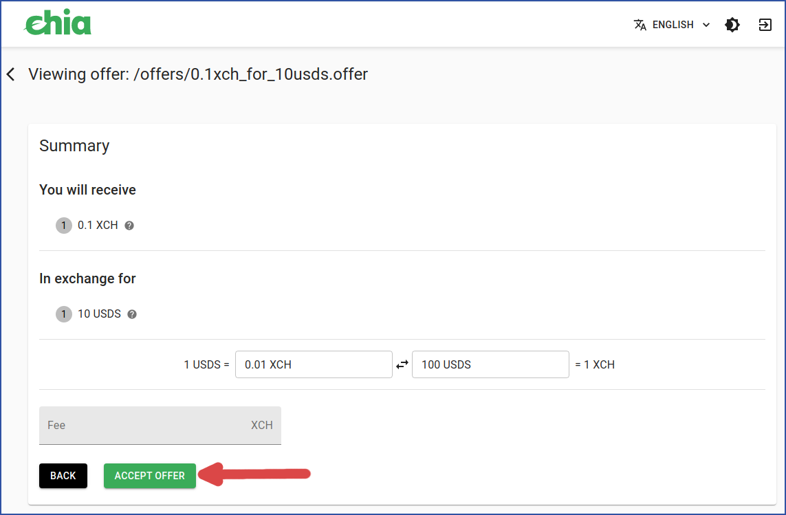

id: offers_gui_tutorial
title: Offers, GUI Tutorial
---

# Offers tutorial (GUI)

## Contents:

* [Add a new CAT wallet](#add-a-new-cat-wallet)
* [Create a single-token offer](#create-a-single-token-offer)
* [Accept a single-token offer](#accept-a-single-token-offer)
* [Cancel an offer](#cancel-an-offer)
* [Create a multiple-token offer](#create-a-multiple-token-offer)
* [Accept a multiple-token offer](#accept-a-multiple-token-offer)
* [Common issues](#common-issues)
-----

## Add a new CAT wallet

In order to create an offer, you must have a wallet for any Chia Asset Tokens (CATs) you want to acquire. If you don't have such a wallet, it's easy to add one.

For example, here's how to add the USDS token:
 

   1. Click "+ ADD TOKEN".

<figure>

<figcaption>
<em></em>
</figcaption>
</figure>
 

   2. Click the "USDS / Stably USD" button.

<figure>

<figcaption>
<em></em>
</figcaption>
</figure>
 

   3. "Adding USDS token" will be displayed while your new wallet is being created. This will take a few minutes.

<figure>

<figcaption>
<em></em>
</figcaption>
</figure>
 

   4. You now have a USDS wallet, in addition to your standard Chia wallet.

<figure>

<figcaption>
<em></em>
</figcaption>
</figure>

-----

## Create a single-token offer

In this example, we'll offer 0.1 XCH in exchange for 10 USDS.
 

   1. Click "MANAGE OFFERS".

<figure>

<figcaption>
<em></em>
</figcaption>
</figure>
 

   2. Click "CREATE AN OFFER".

<figure>

<figcaption>
<em></em>
</figcaption>
</figure>
 

   3. The "Create an Offer" dialog will appear. When you select an asset type to be offered, the dialog will display your spendable balance. After you have filled in the details of your offer, you will also be shown the exchange rate of the assests you want to trade, using the values you have entered.
     When you are satisfied with your offer, click "SAVE OFFER".

<figure>

<figcaption>
<em></em>
</figcaption>
</figure>
 

   4. Choose a name and location for your offer file.
    (Depending on your operating system, this dialog may appear different to what is shown.)

<figure>

<figcaption>
<em></em>
</figcaption>
</figure>
 

   5. A new dialog will appear, suggesting a few locations to share your offer. This is strictly optional. If you don't want to use these options, you could share your offer file with a friend, or on social media, or anywhere else you want.
     That said, for this tutorial we'll click the "OFFERBIN" button.

<figure>

<figcaption>
<em></em>
</figcaption>
</figure>
 

   6. You will be shown the details of your offer once again. Click the "SHARE" button to share your offer.

<figure>

<figcaption>
<em></em>
</figcaption>
</figure>
 

   7. Your offer has now been shared on Offer Bin, a website dedicated to sharing Chia offers. Offer Bin is not affiliated with Chia Network Inc.
     You now have the option to either view your offer on Offer Bin, copy the URL to share in more locations, or simply wait for someone to accept your offer.

<figure>

<figcaption>
<em></em>
</figcaption>
</figure>
 

   8. There is now one offer in the "Manage Offers" dialog. Its status is "Pending Accept".

<figure>

<figcaption>
<em></em>
</figcaption>
</figure>
 

Congratulations! You have created an offer. There are a few things to note:
* Your wallet has reserved the coin(s) necessary to complete the offer.
* The blockchain has not recorded this offer.
* You can distribute the offer file wherever you want.
* Anyone who sees the offer file can attempt to accept it.

-----

## Accept a single-token offer

This example will use a different computer to accept the offer that was created in the previous example. Keep in mind, offers are accepted on a first-come, first-served basis.
 
   1. From your light wallet's main dialog, click "MANAGE OFFERS".

<figure>

<figcaption>
<em></em>
</figcaption>
</figure>
 

  2. Click "VIEW AN OFFER".

<figure>

<figcaption>
<em></em>
</figcaption>
</figure>
 

   3. You can either paste the contents of an offer file, or load the whole file. In this example, we'll do the latter.

<figure>

<figcaption>
<em></em>
</figcaption>
</figure>
 

   4. A new dialog will open. This may look different than what is pictured, depending on your operating system.
    Find the offer file and click "Open". Keep in mind, the name of the offer file doesn't necessarily reflect the actual offer.

<figure>

<figcaption>
<em></em>
</figcaption>
</figure>
 

  5. You'll be shown a summary of the offer. You can add an optional fee (payable in XCH) if you want to prioritize your offer higher than the default of FIFO (First In, First Out). If you agree with the terms, click "ACCEPT OFFER".

<figure>

<figcaption>
<em></em>
</figcaption>
</figure>
 

  6. You'll be given a chance to cancel your acceptance of the offer. Click "ACCEPT OFFER" to continue.

<figure>

<figcaption>
<em></em>
</figcaption>
</figure>
 

   7. After a few seconds, you'll receive a "Success" message. This means the offer has been completed and sent to the blockchain for confirmation.

<figure>

<figcaption>
<em></em>
</figcaption>
</figure>
 

   8. The offer is now in the "Pending Confirm" state.

<figure>

<figcaption>
<em></em>
</figcaption>
</figure>
 

   9. The offer will take a few minutes to be confirmed. Note that this time can vary, depending on how full the mempool is and whether you included a fee upon accepting the offer.

<figure>

<figcaption>
<em></em>
</figcaption>
</figure>
 

   10. After the offer has been confirmed, your new balance will be shown in your wallet.

<figure>

<figcaption>
<em></em>
</figcaption>
</figure>
 

-----

## Cancel an offer

You can cancel any offer you created, as long as it has not been accepted already.
 

   1. In the "Manage Offers" dialog, locate the offer you want to cancel. It must be in the "Pending Accept" state.
    Click the three dots in the "Actions" column.

<figure>

<figcaption>
<em></em>
</figcaption>
</figure>
 

   2. Click "Cancel Offer".

<figure>

<figcaption>
<em></em>
</figcaption>
</figure>
 

   3. The "Cancel Offer" dialog will appear. The default option is to cancel on the blockchain. This option will use your wallet to buy the coins you offered. This will ensure that nobody can accept your offer in the future.
   * You should usually use this option. Do not uncheck the checkbox if you have copied your offer file to another computer or website.

<figure>

<figcaption>
<em></em>
</figcaption>
</figure>
 

   4. If you uncheck the checkbox, your wallet will un-reserve the coins for your offer. However, nothing will be recorded on the blockchain. If you copied your offer file elsewhere, someone could still accept your offer. The advantages of this option are that it will cancel your offer instantly, and for no fee.
  
   If your offer file has been copied to another computer or website, you should not use this option.

<figure>

<figcaption>
<em></em>
</figcaption>
</figure>
 

   5. If you left the checkbox checked in the previous step, your offer will enter the "Pending Cancel" state while the cancellation is being recorded on the blockchain. This could take several minutes.

<figure>

<figcaption>
<em></em>
</figcaption>
</figure>
 

   6. When your order has been successfully canceled, it will enter the "Cancelled" state. Your funds are now available in your wallet.

<figure>

<figcaption>
<em></em>
</figcaption>
</figure>
 

-----

## Create a multiple-token offer

It's easy to create an offer with multiple tokens, on one or both ends of the trade.
 

   1. In the "Create an Offer" dialog, click the "+" to add more tokens. In order for the "+" to be accessible, you must have a wallet with a token that has not been used in this offer.

<figure>

<figcaption>
<em></em>
</figcaption>
</figure>
 

   2. When you are satisfied with the number of tokens being offered and received, click "SAVE OFFER".

<figure>

<figcaption>
<em></em>
</figcaption>
</figure>
 

   3. Your new offer, including all tokens, is now in the "Pending Accept" state.

<figure>

<figcaption>
<em></em>
</figcaption>
</figure>
 

-----

## Accept a multiple-token offer
   1. The process to accept a multiple token offer is the same as it for a single token offer.

   You don't need to have a wallet for all tokens being offered. In this case, you should verify that the asset ID matches the CAT you want to receive.

<figure>

<figcaption>
<em></em>
</figcaption>
</figure>
 

   2. After accepting the offer, a new wallet will be created for any unknown tokens.

<figure>

<figcaption>
<em></em>
</figcaption>
</figure>
 

-----

## Common issues

edge cases
-- accepter wallet doesn't have cat wallet for cat offered
-- maker doesn't have enough money
-- taker doesn't have enough money
-- offer no longer valid
-- coinset issues, 1 coin for whole wallet is already reserved