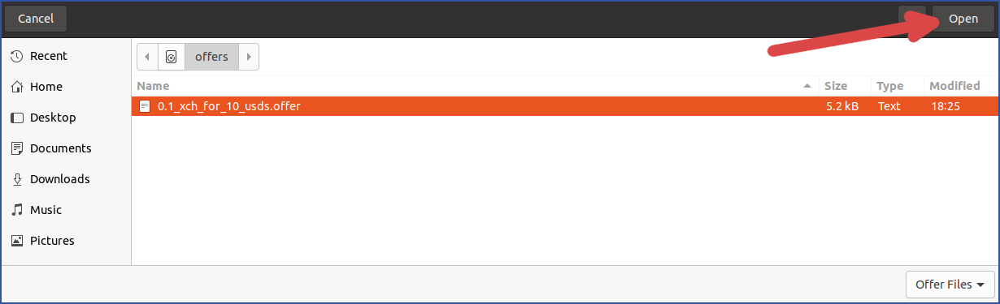
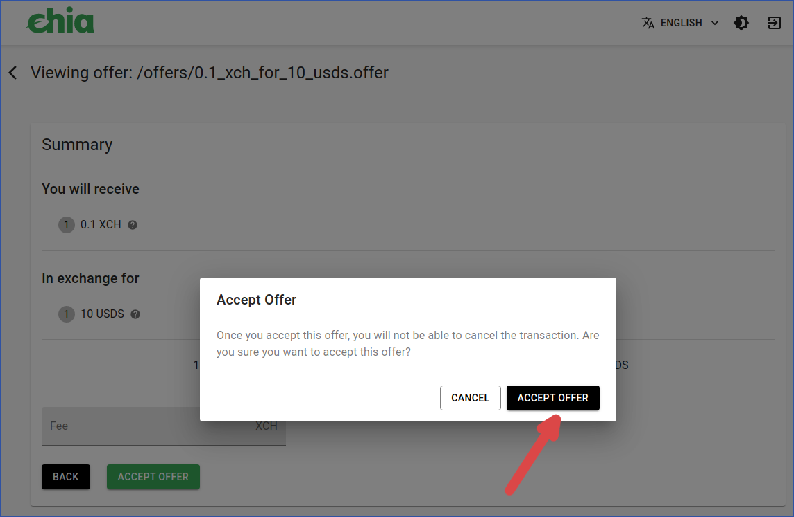
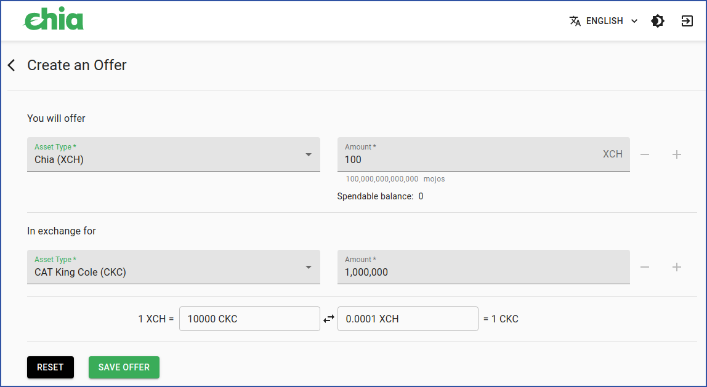
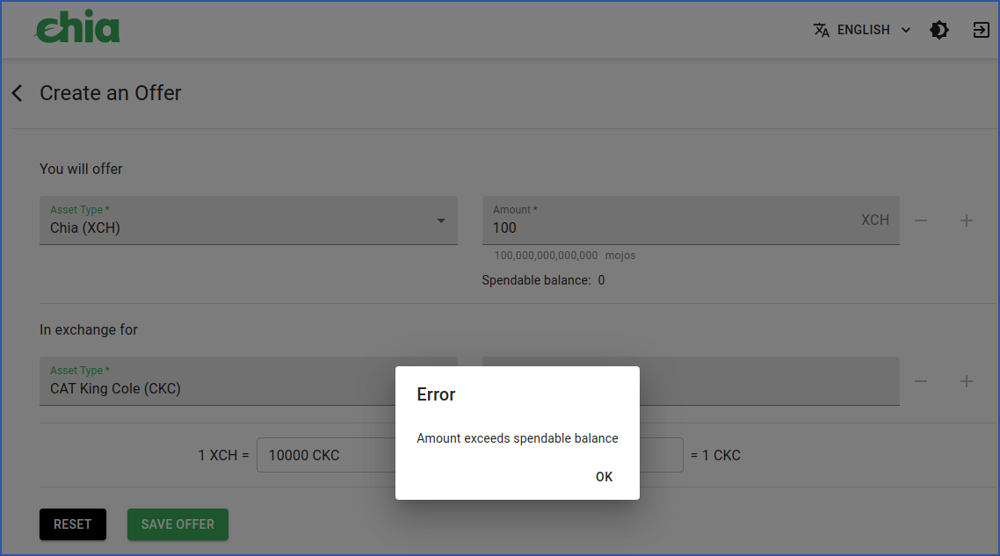
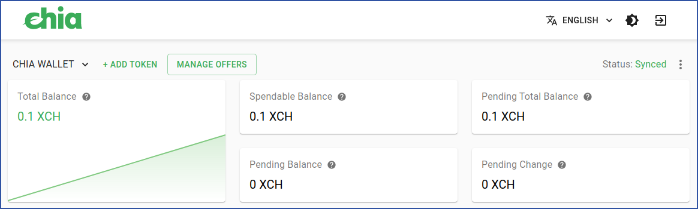

id: offers_gui_tutorial
title: Offers, GUI Tutorial
---

# Offers tutorial (GUI)

This tutorial covers Chia offers using the offical wallet's graphical user interface.

See also our [command line tutorial](../tutorials/offers_cli_tutorial.md "Offers CLI tutorial") and our [reference document](../puzzles/offers.md "Offers reference").

## Contents:

* [Add a new CAT wallet](#add-a-new-cat-wallet)
* [Create a single-token offer](#create-a-single-token-offer)
* [Accept a single-token offer](#accept-a-single-token-offer)
* [Cancel an offer](#cancel-an-offer)
* [Create a multiple-token offer](#create-a-multiple-token-offer)
* [Accept a multiple-token offer](#accept-a-multiple-token-offer)
* [Common issues](#common-issues)
* [Further reading](#further-reading)

-----

<br/>

## Add a new CAT wallet

In order to create an offer, you must have a wallet for any Chia Asset Tokens (CATs) you want to acquire. If you don't have such a wallet, it's easy to add one.

For example, here's how to add the Stably USD (USDS) token:
<br/>

   1. Click "+ ADD TOKEN".

<figure>

</figure>
<br/>

   2. Click the "USDS / Stably USD" button.

<figure>

</figure>
<br/>

   3. "Adding USDS token" will be displayed while your new wallet is being created. This will take some time.

<figure>

</figure>
<br/>

   4. You now have a USDS wallet, in addition to your standard Chia wallet.

<figure>

</figure>

<br/>

-----

<br/>

## Create a single-token offer

In this example, we'll offer 0.1 XCH in exchange for 10 USDS.
<br/>

   1. Click "MANAGE OFFERS".

<figure>

</figure>
<br/>

   2. Click "CREATE AN OFFER".

<figure>

</figure>
<br/>

   3. The "Create an Offer" dialog will appear. When you select an asset type to be offered, the dialog will display your spendable balance. After you have filled in the details of your offer, you will also be shown the exchange rate of the assests you want to trade, using the values you have entered.
   <br/><br/>When you are satisfied with your offer, click "SAVE OFFER".

<figure>

</figure>
<br/>

   4. Choose a name and location for your offer file.
   <br/>(Depending on your operating system, this dialog may appear different to what is shown.)

<figure>

</figure>
<br/>

   5. A new dialog will appear, suggesting a few locations to share your offer. This is strictly optional. You could also directly share your offer file with a friend, or on social media, or anywhere else you want.
   <br/><br/>That said, for this tutorial we'll click the "OFFERBIN" button.

<figure>

</figure>
<br/>

   6. You will be shown the details of your offer once again. Click the "SHARE" button to share your offer.

<figure>

</figure>
<br/>

   7. Your offer has now been shared on Offer Bin, a website dedicated to sharing Chia offers. Offer Bin is not affiliated with Chia Network Inc.
   <br/><br/>You now have the option to view your offer on Offer Bin, copy the URL to share in more locations, or simply wait for someone to accept your offer.

<figure>

</figure>
<br/>

   8. There is now one offer in the "Manage Offers" dialog. Its status is "Pending Accept".

<figure>

</figure>
<br/>

Congratulations! You have created an offer. A few things to note:
* Your wallet has reserved the coin(s) necessary to complete the offer.
* The blockchain has not recorded this offer.
* You can distribute the offer file wherever you want.
* Anyone who sees the offer file can attempt to accept it.

<br/>

-----

<br/>

## Accept a single-token offer

This example will use a different computer to accept the offer that was created in the previous example. Keep in mind, offers are accepted on a first-come, first-served basis.
<br/>
   1. From your light wallet's main dialog, click "MANAGE OFFERS".

<figure>

</figure>
<br/>

  2. Click "VIEW AN OFFER".

<figure>

</figure>
<br/>

   3. You can either paste the contents of an offer file, or load the whole file. In this example, we'll do the latter.

<figure>

</figure>
<br/>

   4. A new dialog will open. This may look different than what is pictured, depending on your operating system.
   <br/>Find the offer file and click "Open". Keep in mind, the name of the offer file doesn't necessarily reflect the actual offer.

<figure>

</figure>
<br/>

  5. You'll be shown a summary of the offer. You can add an optional fee (payable in XCH) if you want Chia's blockchain to prioritize your offer. If you agree with the terms, click "ACCEPT OFFER".

<figure>

</figure>
<br/>

  6. You'll be given a chance to cancel your acceptance of the offer. Click "ACCEPT OFFER" to continue.

<figure>

</figure>
<br/>

   7. After a few seconds, you'll receive a "Success" message. This means the offer has been completed and sent to the blockchain for confirmation.

<figure>

</figure>
<br/>

   8. The offer is now in the "Pending Confirm" state.

<figure>

</figure>
<br/>

   9. The offer will take a few minutes to be confirmed. Note that this time can vary, depending on how full the mempool is and whether you included a fee upon accepting the offer.

<figure>

</figure>
<br/>

   10. After the offer has been confirmed, your new balance will be shown in your wallet.

<figure>

</figure>

<br/>

-----

<br/>

## Cancel an offer

You can cancel any offer you created, as long as it has not already been accepted.
<br/>

   1. In the "Manage Offers" dialog, locate the offer you want to cancel. It must be in the "Pending Accept" state.
   <br/>Click the three dots in the "Actions" column.

<figure>

</figure>
<br/>

   2. Click "Cancel Offer".

<figure>

</figure>
<br/>

   3. The "Cancel Offer" dialog will appear. The default option is to cancel on the blockchain. This option will use your wallet to buy the coins you offered, which will ensure that nobody can accept your offer in the future.

<figure>

</figure>
<br/>

   4. If you uncheck the checkbox, your wallet will un-reserve the coins for your offer. However, nothing will be recorded on the blockchain. If you copied your offer file elsewhere, someone could still accept it.
   
   The advantages of this option are that it will cancel your offer instantly, and there's no need to include a fee.

<figure>

</figure>
<br/>

   5. If you left the checkbox checked in the previous step, your offer will enter the "Pending Cancel" state while the cancellation is being recorded on the blockchain. This could take several minutes.

<figure>

</figure>
<br/>

   6. When your order has been successfully canceled, it will enter the "Cancelled" state. Your funds are now available in your wallet.

<figure>

</figure>

<br/>

-----

<br/>

## Create a multiple-token offer

It's easy to create an offer with multiple tokens, on one or both ends of the trade.
<br/>

   1. In the "Create an Offer" dialog, click the "+" to add more tokens. In order for the "+" to be accessible, you must have a wallet with a token that has not been used in this offer.

<figure>

</figure>
<br/>

   2. When you are satisfied with the number of tokens being offered and received, click "SAVE OFFER".

<figure>

</figure>
<br/>

   3. Your new offer, including all tokens, is now in the "Pending Accept" state.

<figure>

</figure>

<br/>

-----

<br/>

## Accept a multiple-token offer
   1. The process to accept a multiple-token offer is the same as for a single-token offer.

   You don't need to have a wallet for all tokens being offered. In this case, you should verify that the asset ID matches the CAT you want to receive.

<figure>

</figure>
<br/>

   2. After accepting the offer, a new wallet will be created for any unknown tokens.

<figure>

</figure>

<br/>

-----

<br/>

## Potential issues

This section will detail a non-comprehensive list of issues you might encounter while making or taking offers.

## Contents:

* [Maker doesn't have enough money](#maker-doesnt-have-enough-money)
* [Taker doesn't have enough money](#taker-doesnt-have-enough-money)
* [Taker accepts an unknown CAT offer](#taker-accepts-an-unknown-cat-offer)
* [Taker attempts to accept an invalid offer](#taker-attempts-to-accept-an-invalid-offer)
* [Maker cancels an offer locally, Taker accepts the offer](#maker-cancels-an-offer-locally-taker-accepts-the-offer)
* [Whole coins must be reserved](#whole-coins-must-be-reserved)

<br/>

-----

<br/>

### Maker doesn't have enough money

Let's say a Maker has wallets for XCH and CKC, with no money in either of them.

<figure>

</figure>
<figure>

</figure>

<br/>

The maker attempts to make an ambitious offer: 100 XCH for 1 million CKC.

<figure>

</figure>
<br/>

However, the Maker does not have enough money to create this offer. As a result, an Error is displayed:
<figure>

</figure>

<br/>

-----

<br/>

### Taker doesn't have enough money

Let's say the Taker has a brand new wallet:

<figure>

</figure>
<br/>

And there's an outstanding offer requesting 0.1 XCH for 10,000 CKC:

TODO: create image file

<br/>

However, the Taker does not have enough money to accept this offer. As a result, an Error is displayed:

TODO: create image file

<br/>

-----

<br/>

### Taker accepts an unknown CAT offer

You should be extra careful before accepting offers for unknown CATs. This is because the offer _might_ be a scam where a different -- and worthless -- token is actually being offered.

Here's how the scam would work:

Let's say a potential Taker has 0.1 XCH in their wallet.

<figure>

</figure>
<br/>

There is an offer of 0.25 Shibe (an unknown CAT) in exchange for 0.1 XCH. Here's the offer from the Taker's perspective:
<figure>

</figure>
<br/>

The Taker decides to accept the offer and it is confirmed successfully:
```bash
(venv) $ chia wallet take_offer ~/offers/0.25_Shibe_for_0.1_XCH.offer 
Summary:
  OFFERED:
    - a2cadb541cb01c67c3bcddc73ecf33c8ffa37b0d013688904b2747cede020477 (Wallet ID: Unknown): 0.25 (250 mojos)
  REQUESTED:
    - XCH (Wallet ID: 1): 0.1 (100000000000 mojos)
Fees: 0
Would you like to take this offer? (y/n): y
Accepted offer with ID 4ac6a35e5fecb50d85604b19250a942afdc81876fe11db1f9d970c95dcf2c43f
Use chia wallet get_offers --id 4ac6a35e5fecb50d85604b19250a942afdc81876fe11db1f9d970c95dcf2c43f -f 1234567890 to view its status
```

Notice that the offer file was named `0.25_Shibe_for_0.1_XCH.offer`, but the file name itself does _not_ dictate the contents of the offer. The Taker may have inadvertantly accepted an offer for a worthless token!

Luckily, it is easy to avoid this scam by cross-referencing the unknown CAT's ID before accepting the offer. In this case, the Taker should verify from a trusted source that `4ac6a35e5fecb50d85604b19250a942afdc81876fe11db1f9d970c95dcf2c43f` indeed corresponds to Shibe.

Chia does install a list of known CATs by default, so this scam should be rare, but you should always be diligent in scrutinizing offers for unknown CATs.

<br/>

-----

<br/>

### Taker attempts to accept an invalid offer

<br/>

-----

<br/>

### Maker cancels an offer locally, Taker accepts the offer

<br/>

-----

<br/>

### Whole coins must be reserved

<br/>

-----

<br/>

## Further reading

* [Offers blog entry]()
* [Offers reference](../puzzles/offers.md "Offers reference")
* [CLI tutorial](../tutorials/offers_cli_tutorial.md "Offers CLI tutorial")
* [Info on the coin set model](https://docs.chia.net/docs/04coin-set-model/what-is-a-coin "Coin set model")